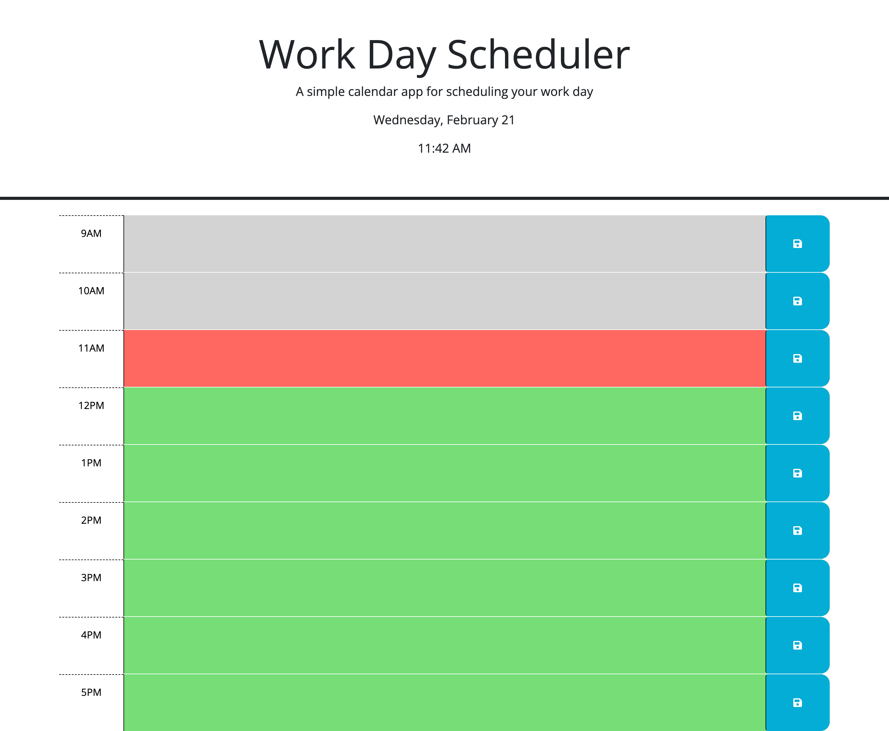

# Scheduler

## Description

Scheduler is a dynamic and user-friendly web application designed to help users manage their daily tasks efficiently. The motivation behind this project was to create an easily accessible and straightforward tool for task management. Scheduler addresses the need for a simple yet effective way to organize daily activities, enhancing productivity and time management. This project provided valuable insights into web application development, particularly in creating intuitive user interfaces and implementing interactive features.

## Installation

Visit: [scheduler-url](https://nardgie.github.io/scheduler/)

## Usage

To use Scheduler:

1. Visit the provided URL.
2. Add your tasks to the time slots provided for each day.
3. Click the blue save button to save or remove that task.
4. Easily view and manage your daily schedule with an intuitive interface.

``` md

```

## Credits 

This project was developed by Nardgelen Jean Francois. 

## License

MIT License

Copyright (c) 2024 Nardgelen Jean Francois

Permission is hereby granted, free of charge, to any person obtaining a copy
of this software and associated documentation files (the "Software"), to deal
in the Software without restriction, including without limitation the rights
to use, copy, modify, merge, publish, distribute, sublicense, and/or sell
copies of the Software, and to permit persons to whom the Software is
furnished to do so, subject to the following conditions:

The above copyright notice and this permission notice shall be included in all
copies or substantial portions of the Software.

THE SOFTWARE IS PROVIDED "AS IS", WITHOUT WARRANTY OF ANY KIND, EXPRESS OR
IMPLIED, INCLUDING BUT NOT LIMITED TO THE WARRANTIES OF MERCHANTABILITY,
FITNESS FOR A PARTICULAR PURPOSE AND NONINFRINGEMENT. IN NO EVENT SHALL THE
AUTHORS OR COPYRIGHT HOLDERS BE LIABLE FOR ANY CLAIM, DAMAGES OR OTHER
LIABILITY, WHETHER IN AN ACTION OF CONTRACT, TORT OR OTHERWISE, ARISING FROM,
OUT OF OR IN CONNECTION WITH THE SOFTWARE OR THE USE OR OTHER DEALINGS IN THE
SOFTWARE.

--------------------------------

## Features

- Easy-to-use daily task scheduler
- Persistent storage of tasks
- Responsive and intuitive design


